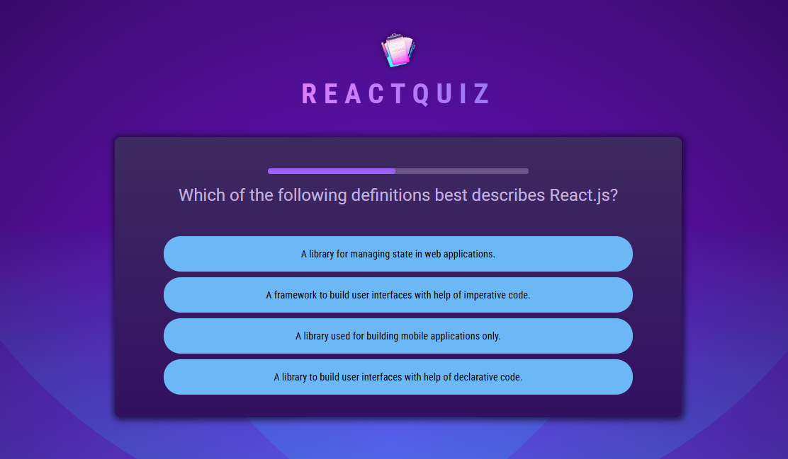
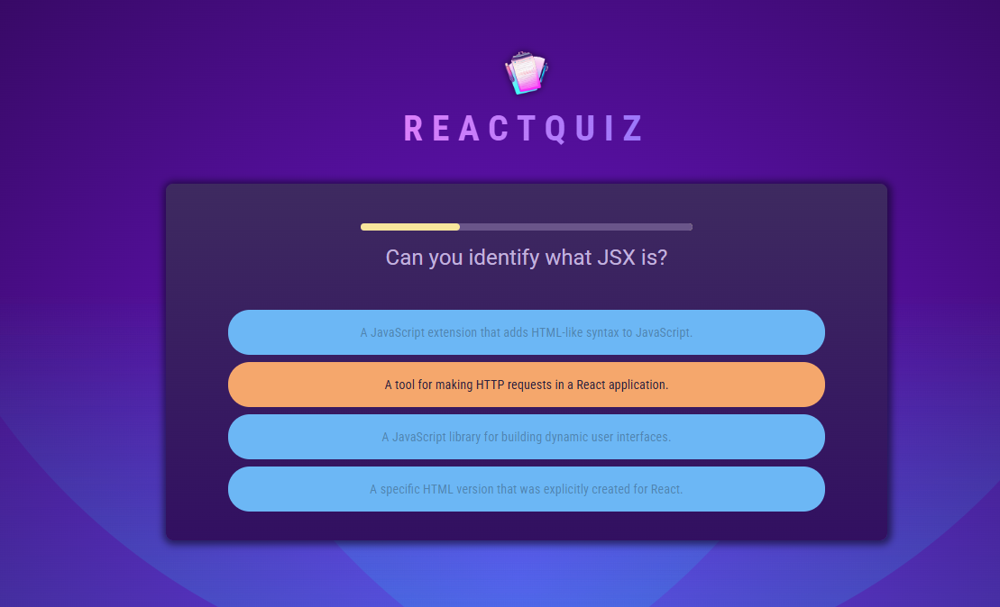
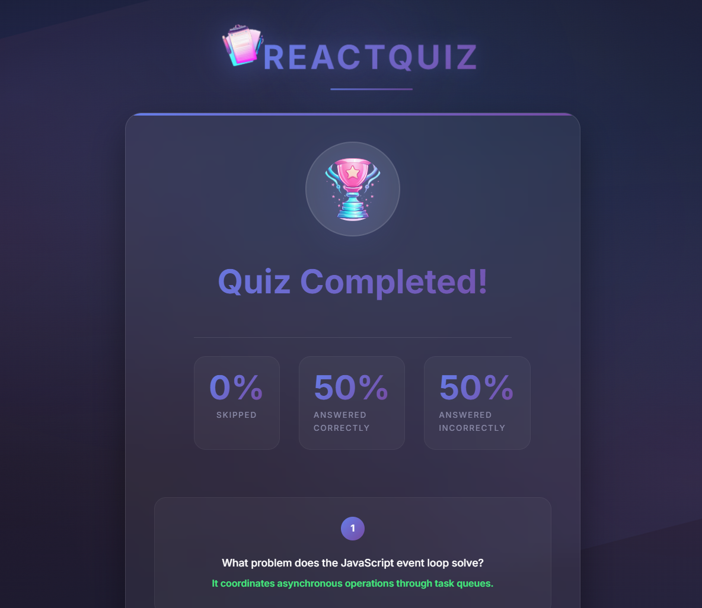

# ReactQuiz

**ReactQuiz** is an interactive quiz application built with **React.js**.  
It demonstrates the use of modern React concepts such as functional components, hooks (`useState`, `useEffect`, `useCallback`, `useRef`), and declarative UI rendering.  
The project focuses on composable component architecture, state-driven logic, and precise control over timed transitions and visual feedback without relying on external state management libraries.

<h3>🎯 Quick Access - Click Below to Visit</h3>

<a href="https://r-quiz-beryl.vercel.app/" target="_blank" style="text-decoration: none;">
  

    🌐 Project Overview
  

</a>

<h3 align="center">📸 Project Preview</h3>

   
  

  

  

  

---

## Project Overview

The application presents a series of questions that users must answer within a time limit.  
Each question includes a countdown timer, real-time state visualization ("answered", "correct", "wrong"), and a detailed summary at the end.  
All transitions, delays, and correctness checks are handled internally via React hooks, emphasizing pure, predictable, and reactive design.

---

## Core Features

- **Step-by-step quiz flow** – each question appears sequentially, with automatic progression after selection or timeout.  
- **Dynamic timer component** – the `QuestionTimer` component manages countdowns and triggers skip events upon expiration.  
- **Smart visual states** – answers transition through multiple visual phases (`answered → correct/wrong → next question`).  
- **Real answer validation** – correct answers are validated dynamically against the question data.  
- **Answer randomization** – choices are shuffled once per question using `useRef` to prevent re-renders.  
- **Final statistics screen** – `Summary` displays calculated percentages of skipped, correct, and wrong answers.  
- **Component-driven structure** –  
  - `App` – application layout  
  - `Header` – logo and title  
  - `Quiz` – manages quiz progression  
  - `Question` – handles answer selection and validation logic  
  - `Answers` – renders answer options with visual feedback  
  - `QuestionTimer` – time tracking logic  
  - `Summary` – post-quiz analytics and results overview  

---

## Technologies Used

- **React.js (v18)** – UI library for component-based rendering  
- **JavaScript (ES2022)** – modern language features and asynchronous logic  
- **Vite / React Scripts** – build and dev environment  
- **HTML5 & CSS3** – progress visualization and layout styling  
- **React Hooks** – component-level state and lifecycle management  

---

## Technical Highlights

- Time and visual synchronization managed through nested `setTimeout` + `useEffect`.  
- `useRef` used to cache shuffled answers and prevent unnecessary re-renders.  
- Controlled logic transitions via computed states (`answerState`, `selectedAnswer`, `isCorrect`).  
- No external dependencies — pure React-based data and UI synchronization.  
- Timer resets elegantly through a dynamic React `key`, forcing remount on each question.  
- Modular architecture ensuring each component is isolated, reusable, and testable.  

---

## Architecture & Design Principles

- **Purely declarative logic** – UI is always derived from component state.  
- **Stateless parent, stateful children** – the main `Quiz` component orchestrates data flow via props.  
- **No global store** – each component manages its own lifecycle and behavior.  
- **Deterministic rendering** – identical inputs always yield the same visual and logical outcome.  
- **Strong separation of concerns** – timer, questions, and UI feedback are independent units.  

---

## Educational Purpose

**ReactQuiz** serves as a showcase and learning project for mastering:
- State-driven rendering in React.
- Hook-based logic control.
- Component communication through props and callbacks.
- Managing asynchronous state transitions in complex UIs.

The codebase demonstrates how to implement **timed user interactions**, **synchronized state transitions**, and **conditional rendering** — all with idiomatic, modern React.

---
